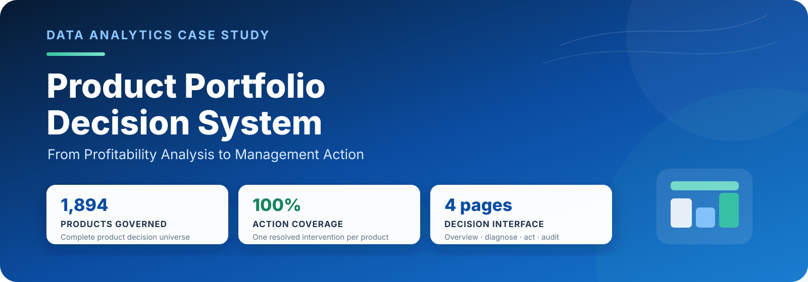
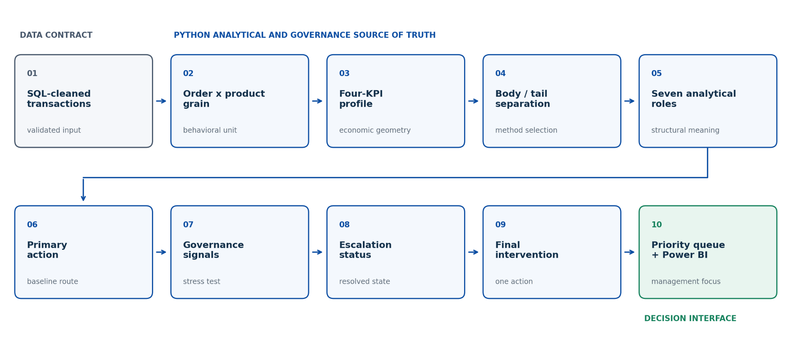
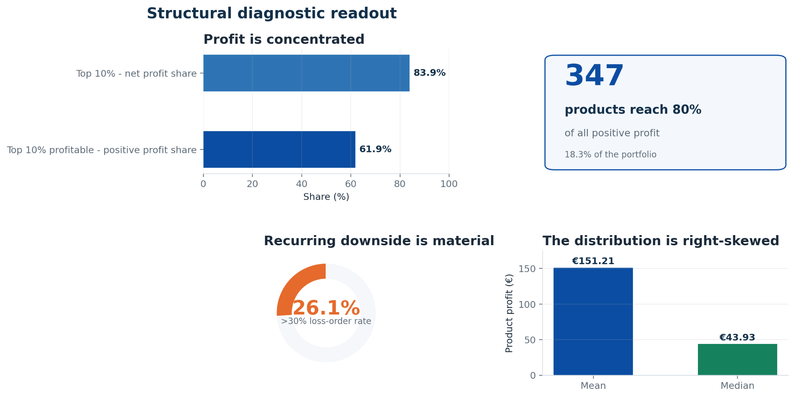
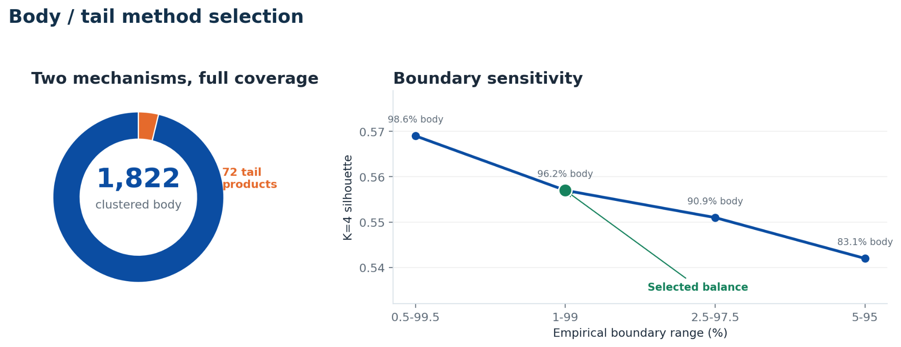
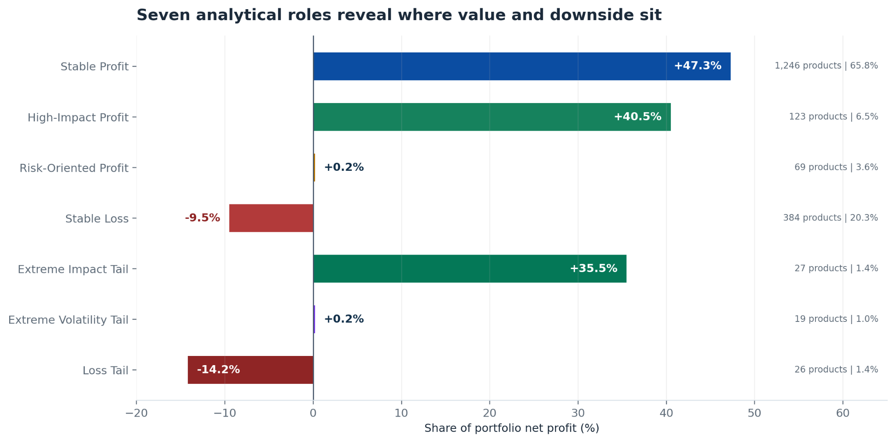
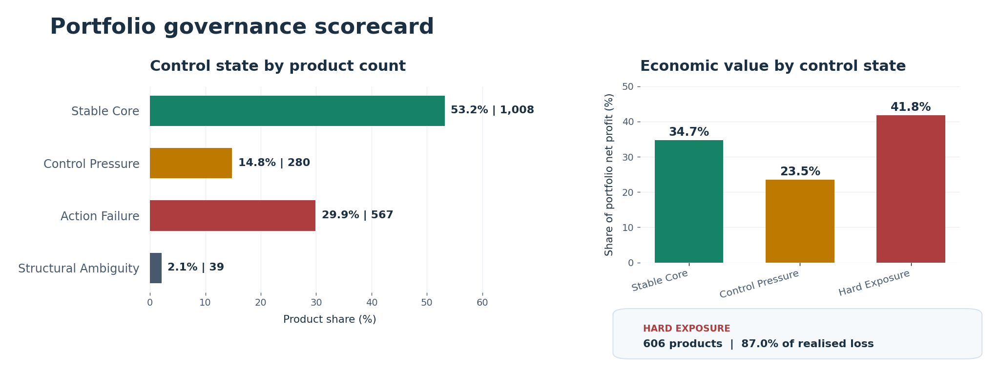
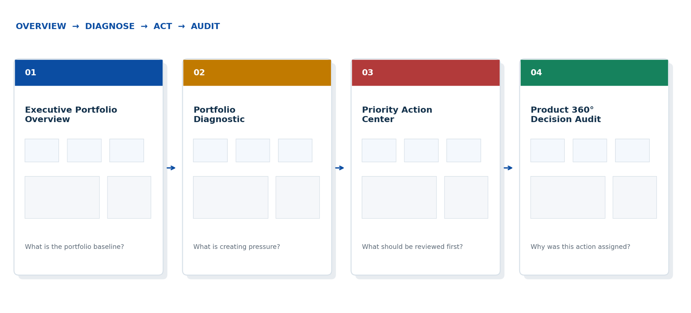

  

  <strong>From Product Profitability Reporting to Portfolio Control and Management Action</strong> 
  An end-to-end analytics, governance, and Power BI decision-support case study

  <code>Python</code>&nbsp;&nbsp;
  <code>SQL</code>&nbsp;&nbsp;
  <code>Power BI</code>&nbsp;&nbsp;
  <code>Statistical Analysis</code>&nbsp;&nbsp;
  <code>Portfolio Governance</code>

---

## Executive summary

### The portfolio is profitable. The real question is whether that value can be controlled, protected, and scaled.

Traditional profitability reporting shows which products made or lost money. It does not show whether that result is repeatable, whether losses are recurring, whether too much value depends on a small number of products, or whether the current management strategy still fits the evidence.

This project closes that decision gap. It turns cleaned transaction data into a portfolio-control system that evaluates every product across **profitability, volatility, loss frequency, and economic scale**. It then identifies the product's economic role, proposes a baseline management action, tests whether that action still holds, and resolves the evidence into **one final intervention per product**.

The portfolio contains **1,894 products** and generates approximately **€286,397 in net profit**. That headline is positive, but the underlying structure is uneven.

| Portfolio signal | Current result | What it means for management |
|---|---:|---|
| **Profit concentration** | **7.9% of products generate 75.9% of net profit** | Most value depends on a very small part of the portfolio. |
| **Stable Core** | **53.2% of products generate 34.7% of net profit** | More than half the products are stable, but most profit sits outside the fully stable management layer. |
| **Hard Exposure** | **606 products · 32.0%** | Almost one third of the portfolio needs a different action route or classification review. |
| **Misaligned Upside** | **80 products · €89,098 profit · 0% realised loss** | Strong, reliable value may be managed too cautiously and should be validated before scaling. |
| **Broken Value** | **158 products · −€22,609 impact · 66.2% of realised loss** | Downside and management-route failure point in the same direction: correction, restructuring, restriction, or exit review. |

*Broken Value's −€22,609 is the group's net result. Its 66.2% loss share uses the €51,041 of realised loss from net-negative products in the group, divided by €77,092 of realised loss across the portfolio.*

> [!IMPORTANT]
> The central finding is not simply that the portfolio makes money. It is that economic value and management control are distributed very differently. Priority must therefore follow **economic exposure and action need**, not product count alone.

### The management response

1. **Protect the dependable base** that continues to create repeatable value.
2. **Control concentrated and fragile profit** before increasing dependency on it.
3. **Validate hidden upside** where performance is stronger and more reliable than the current route suggests.
4. **Correct or exit broken value** where weak economics and action failure reinforce each other.

---

## 1. Business context and core question

### A profit ranking tells management what happened. It does not tell management what to do next.

Two products can generate the same total profit and still require completely different decisions. One may earn that profit consistently across many orders. Another may depend on a few exceptional transactions, lose money frequently, or fluctuate so heavily that scaling it would increase risk rather than value.

The same problem appears on the downside. A loss-making product may be temporarily weak and recoverable, structurally unprofitable, or simply assigned to the wrong management route. Treating all three cases in the same way hides the actual decision.

The project was therefore built around one practical question:

> **Which products can be managed reliably, which require tighter control or a change of strategy, and where should management act first — based on reliability, downside exposure, economic importance, and strategy fit?**

That question is answered in three stages:

| Stage | Question | Decision value |
|---|---|---|
| **Outcome** | Where are profit and realised losses concentrated? | Shows the true economic structure of the portfolio. |
| **Control** | How reliable is that result, and does the current route still fit? | Separates stable value from pressure, failure, and uncertainty. |
| **Action** | Which cases deserve attention first? | Converts analysis into a focused management queue. |

---

## 2. What was built

### One traceable path from raw transactions to management action

*Figure 1. Each analytical layer produces a controlled output that becomes the input to the next decision layer.*

The system follows a simple operating logic:

1. **Build a reliable product view.** Cleaned transactions are converted into the correct order-product and product-level structures.
2. **Describe the complete economic behaviour of each product.** Profitability is combined with volatility, downside frequency, and portfolio importance.
3. **Identify the product's structural role.** Recurring patterns and economically extreme cases are analysed with methods suited to each group.
4. **Assign a baseline action.** Each role maps to one initial direction: **Protect, Optimize, Contain, or Correct**.
5. **Stress-test that direction.** Governance signals check whether the action still fits the product's observed behaviour.
6. **Resolve one final intervention.** Conflicting signals follow a fixed precedence rule, so every product reaches one auditable route.
7. **Prioritise management attention.** The portfolio is narrowed to the products where action can protect value, reduce loss, or validate reliable upside.

### Clear ownership across the stack

| Layer | Responsibility |
|---|---|
| **SQL** | Cleans and validates the source data and establishes the upstream data contract. |
| **Python** | Builds the economic profile, structural roles, governance logic, final interventions, and priority zones. |
| **Power BI** | Lets a manager review the portfolio, diagnose pressure, inspect priority products, and audit individual decisions. |

The dashboard does not recreate the model in DAX. It presents and explores the governed output produced by Python, keeping the decision logic consistent and traceable.

---

## 3. Analytical approach

### From portfolio evidence to a management-ready decision

The analysis progresses through a controlled sequence. Each stage answers a different question and produces the evidence required by the next one:

1. **Data Foundation** — Can the source data support a reliable product-level decision?
2. **Structural Diagnostics** — Does the portfolio behave like one uniform system?
3. **KPI Geometry** — How does each product create value, risk, and economic exposure?
4. **Structural Roles** — What type of economic behaviour does each product represent?
5. **Governance** — Does the management action implied by that role still fit the evidence?
6. **Portfolio Priority** — Which products require management attention first?

This separation is important. **Clustering describes the economic structure of the portfolio. Governance tests whether the strategy attached to that structure remains suitable. Priority identifies where the resulting decisions matter most.**

### 3.1 Data Foundation — Building the correct decision unit

The source data is transactional, while the final decision is made at product level. Repeated rows belonging to the same product within the same order were therefore consolidated before any behavioural measure was calculated.

This created an **Order × Product base**, where each row represents one product's complete economic result within one order. That base was then aggregated into a **Product-Level Decision Base**, using **Product ID × Product Name** as the working key.

| Controlled structure | Portfolio scale | Analytical purpose |
|---|---:|---|
| **Order × Product Base** | **9,986 observations** | Measures how each product behaves across orders without giving repeated transaction lines artificial weight. |
| **Product-Level Decision Base** | **1,894 products** | Provides one governed record per product for segmentation, governance, and management action. |

This grain control protects every downstream measure. If repeated transaction lines were treated as independent orders, average profit, volatility, loss frequency, and even product counts could be distorted. Sales, profit, and product coverage were also reconciled back to the cleaned source, with no silent product removal.

> **Management question:** Can every later product decision be traced back to a consistent and economically reconciled source record?

### 3.2 Structural Diagnostics — Understanding the portfolio before modelling

Before assigning any role, the analysis tested whether the portfolio behaved like one relatively uniform system or contained meaningful structural differences.

*Figure 2. The portfolio is economically uneven before any segmentation model is applied.*

The diagnostics revealed a concentrated and asymmetric portfolio:

- the top 10% of products generate **83.9% of portfolio net profit**;
- among profitable products, the top decile generates **61.9% of positive profit**;
- only **347 profitable products** are required to reach 80% of positive profit;
- mean product profit is **€151.21**, compared with a median of **€43.93**;
- **26.1% of products** lose money in more than 30% of their observed orders.

These findings are not an output of K-means. They are visible before clustering and establish why one management rule cannot describe every product adequately.

> **Management question:** Where are profit, realised loss, concentration, and unusual economic behaviour located?

### 3.3 KPI Geometry — Describing the complete economic behaviour of each product

Total profit alone cannot distinguish dependable value from fragile or concentrated value. Each product was therefore represented through four complementary dimensions.

| Economic dimension | Plain-English meaning | Technical measure |
|---|---|---|
| **Profitability** | Does the product create value in a typical order? | Mean Order Profit |
| **Volatility** | How much does its result fluctuate around its own average? | Stabilised Coefficient of Variation |
| **Loss Frequency** | How often does the product generate a negative result? | Percentage of negative order-product observations |
| **Economic Scale** | How much does the product matter to the portfolio? | Signed relative profit impact |

These dimensions answer different questions. A product may be profitable on average but lose money frequently. Another may be highly consistent but economically small. A third may generate substantial profit while creating dependency because a large share of portfolio value relies on it.

No single KPI is therefore treated as a complete product verdict.

<strong>Technical assurance — volatility treatment</strong>

The Coefficient of Variation can become unstable when average profit is close to zero. Its modelling version was therefore stabilised without replacing the underlying evidence:

- stabilisation epsilon: **0.2533**;
- model CV cap: **22.67**;
- CV not estimable for **93 products (4.91%)** with fewer than two observations;
- extreme CV capped for modelling for **18 products (0.95%)**.

Raw values and audit flags remain attached to each product. A neutral modelling coordinate for a low-support product means **insufficient volatility evidence**, not observed stability.

> **Management question:** Does the product generate value, how reliably does it generate it, how often does it create downside, and how important is it to the portfolio?

### 3.4 Structural Roles — From KPI geometry to a seven-role taxonomy

The KPI geometry showed that most products occupy recurring positions within the portfolio, while a small group sits far outside its central economic ranges.

The structural analysis therefore followed three distinct steps:

1. separate the recurring portfolio body from the structural tail;
2. apply K-means clustering only to the recurring body;
3. classify tail products separately according to the mechanism that makes them extreme.

#### Step 1 — Separate the portfolio body from the structural tail

The body/tail boundary was defined **before K-means was applied**. Products were evaluated against the empirical **1st–99th percentile ranges** of Mean Order Profit, stabilised CV, and Profit Scale.

Loss Rate remained an active clustering feature, but it was not used as an additional body/tail boundary because its natural range is already limited between 0% and 100%.

| Portfolio layer | Products | Share | Analytical treatment |
|---|---:|---:|---|
| **Clustered Body** | **1,822** | **96.2%** | Standardised K-means clustering |
| **Structural Tail** | **72** | **3.8%** | Mechanism-based tail classification |

*Figure 3. The selected 1st–99th percentile boundary preserves broad portfolio coverage while keeping structural extremes visible.*

This is not outlier deletion. All 72 tail products remain in the portfolio, retain their economic contribution, and continue through governance and prioritisation.

#### Step 2 — Apply K-means to the recurring portfolio body

K-means was applied only to the **1,822 body products**. Before clustering, the four KPIs were standardised so that variables measured on different scales contributed comparably to the distance calculation.

K-means then grouped products whose complete economic profiles were close in this standardised four-dimensional space. The method identified four recurring roles:

1. **Stable Profit** — A broad and comparatively reliable profit base.
2. **High-Impact Profit** — Products making a disproportionate positive contribution.
3. **Risk-Oriented Profit** — Positive but volatile, fragile, or control-sensitive economics.
4. **Stable Loss** — Recurring weak or loss-oriented economic behaviour.

<strong>Technical assurance — why four K-means clusters?</strong>

Several values of (K) were compared:

| Number of clusters | Silhouette score |
|---:|---:|
| 2 | 0.506 |
| 3 | 0.554 |
| **4 — selected** | **0.557** |
| 5 | 0.536 |

The four-cluster solution provided the strongest tested separation while retaining distinct and interpretable business profiles. Across 100 independent 80% resamples, the median Adjusted Rand Index was approximately **0.976**, indicating that the core role structure remained highly stable when the sample composition changed.

#### Step 3 — Classify the structural tail by economic mechanism

K-means was not used for the 72 tail products because these observations are structurally extreme rather than part of the recurring central geometry.

They were instead classified through explicit rules anchored to the body distribution:

1. **Extreme Impact Tail** — Disproportionate economic contribution and portfolio-dependency risk.
2. **Extreme Volatility Tail** — Severe instability and limited controllability.
3. **Loss Tail** — Embedded downside requiring correction, restructuring, or exit review.

Together, the four body clusters and three tail regimes form a **seven-role analytical taxonomy**.

*Figure 4. The seven analytical roles separate product footprint from economic contribution.*

#### Executed structural result

| Analytical role | Analytical origin | Products | Product share | Net-profit share | Baseline action |
|---|---|---:|---:|---:|---|
| **Stable Profit** | K-means body cluster | 1,246 | 65.8% | +47.3% | Protect |
| **High-Impact Profit** | K-means body cluster | 123 | 6.5% | +40.5% | Optimize |
| **Risk-Oriented Profit** | K-means body cluster | 69 | 3.6% | +0.2% | Contain |
| **Stable Loss** | K-means body cluster | 384 | 20.3% | −9.5% | Correct |
| **Extreme Impact Tail** | Rule-based tail regime | 27 | 1.4% | +35.5% | Optimize |
| **Extreme Volatility Tail** | Rule-based tail regime | 19 | 1.0% | +0.2% | Contain |
| **Loss Tail** | Rule-based tail regime | 26 | 1.4% | −14.2% | Correct |

The table reveals the portfolio's main structural imbalance:

- **150 high-impact products**, representing only **7.9% of the portfolio**, generate **75.9% of net profit**;
- **410 loss-oriented products**, representing **21.6% of the portfolio**, create a negative impact equal to **23.7% of net profit**.

The analytical role answers what type of economic behaviour a product currently represents. It does not yet determine the final management decision.

> **Management question:** What type of economic behaviour does this product represent?

### 3.5 Governance — From analytical role to final intervention

**The clustering stage ends with the analytical role. The governance stage begins by testing what management should do with it.**

Each role is first translated into a **Primary Management Action**. This is the action that would normally follow if the product's structural classification were accepted without additional concerns.

#### Step 1 — Translate analytical roles into primary actions

| Primary action | Analytical roles | Baseline management logic |
|---|---|---|
| **Protect** | Stable Profit | Preserve dependable value and maintain margin discipline. |
| **Optimize** | High-Impact Profit · Extreme Impact Tail | Improve or defend high-value contribution while controlling dependency. |
| **Contain** | Risk-Oriented Profit · Extreme Volatility Tail | Limit exposure and stabilise fragile economics before expansion. |
| **Correct** | Stable Loss · Loss Tail | Repair structurally weak economics or prepare restructuring and exit logic. |

This creates a consistent starting route, but that route is not accepted blindly.

#### Step 2 — Stress-test the baseline action

Every product is evaluated through four independent Governance Signals.

| Governance signal | What it tests | Management meaning |
|---|---|---|
| **Deterioration** | Whether profit, volatility, or loss frequency breaches the tolerance of the assigned role | The product's observed economics may no longer support its baseline route. |
| **Concentration** | Whether the product creates excessive positive portfolio dependency | Strong profit may still require tighter control because too much value depends on one product. |
| **Tail Overlap** | Whether more than one structural-tail mechanism is active | The product may not fit one clean economic interpretation. |
| **Classification Instability** | Whether the product is weakly anchored or near an assignment boundary | The assigned role may need review before management acts. |

Here, **Deterioration** means a role-relative tolerance breach within the current portfolio snapshot. It does not claim that performance declined over time. **Classification Instability** means weak structural anchoring, not observed migration between roles.

#### Step 3 — Resolve the signals into one escalation status

Several signals can be active simultaneously, but management still needs one resolved consequence. A fixed precedence rule determines which signal controls the next decision:

**Reassess Classification > Reroute Action > Intensify Action > No Escalation**

| Escalation status | Governance meaning |
|---|---|
| **No Escalation** | The baseline management route continues to fit the evidence. |
| **Intensify Action** | The route still fits but requires tighter supervision or stronger execution. |
| **Reroute Action** | The analytical role remains credible, but the baseline action no longer fits the observed behaviour. |
| **Reassess Classification** | The structural assignment itself is uncertain and should be reviewed before action routing. |

The precedence rule does not delete lower-order signals. All active evidence remains stored for product-level audit.

#### Step 4 — Resolve one final intervention

The Primary Action and Escalation Status are combined through one transparent rule:

> **Primary Action × Escalation Status = Final Intervention**

<strong>Decision matrix — how the final intervention is resolved</strong>

| Primary action | No Escalation | Intensify Action | Reroute Action | Reassess Classification |
|---|---|---|---|---|
| **Protect** | Protect | Protect — Tight Control | Reroute to Contain / Correct | Reassess Classification |
| **Optimize** | Optimize | Optimize — Risk-Controlled | Reroute to Correct | Reassess Classification |
| **Contain** | Contain | Contain — Strict | Reroute to Correct | Reassess Classification |
| **Correct** | Correct | Correct — Accelerated | Exit / Restructure | Reassess Classification |

The matrix covers all 16 action-status combinations. Unknown combinations fail explicitly instead of entering an undefined residual category.

This creates complete decision coverage: all **1,894 products** retain their economic KPIs, analytical role, Primary Action, active Governance Signals, resolved Escalation Status, and Final Intervention.

> **Management question:** Does the initial management strategy still fit the product's observed behaviour, and what action should management take now?

### 3.6 Portfolio Control and Priority — From product decisions to management focus

After every product receives a Final Intervention, the analysis moves from individual product routing to portfolio-level control.

This stage answers two different questions:

1. How much of the portfolio remains aligned with its assigned management logic?
2. Which economically important products deserve additional attention first?

#### Step 1 — Summarise portfolio control through Governance States

Final Interventions are aggregated into four mutually exclusive Resolved Governance States.

| Resolved Governance State | Products | Product share | Portfolio meaning |
|---|---:|---:|---|
| **Stable Core** | 1,008 | 53.2% | The baseline route holds without escalation. |
| **Control Pressure** | 280 | 14.8% | The route still holds but requires tighter supervision. |
| **Action Failure** | 567 | 29.9% | The assigned role is trusted, but the current action must change. |
| **Structural Ambiguity** | 39 | 2.1% | Classification should be reviewed before action routing. |

The Stable Core contains more than half of all products but generates only **34.7% of portfolio net profit**. By contrast, **Hard Exposure**—Action Failure plus Structural Ambiguity—contains **606 products (32.0%)**, **41.8% of portfolio net profit**, and **87.0% of realised loss**.

#### Step 2 — Identify where management attention should go first

Governance gives every product a valid route. The Priority Zone layer determines which governed products deserve additional management attention.

Products are evaluated against their performance relative to other products in the same analytical role, whether their current route still holds, whether positive performance is reliable enough to act on, and how much economic value or downside is attached to the signal.

| Priority zone | What it identifies | Management response |
|---|---|---|
| **Misaligned Upside** | Reliable outperformance under a route that remains under governance stress | Validate the classification and commercial context before scaling. |
| **Fragile Value** | Positive performance that fails one or more reliability safeguards | Stabilise volatility or downside before further investment. |
| **Broken Value** | Weak role-relative performance combined with hard governance exposure | Correct, restructure, restrict, or consider exit. |
| **Defendable Value** | Strong performance inside a management route that continues to hold | Protect and maintain. |
| **Watchlist / Unresolved** | Weak or uncertain performance without enough evidence for an immediate hard intervention | Monitor, diagnose, and reassess when evidence improves. |

The active queue contains **953 products (50.3%)**. The remaining **941 products** still retain a valid Final Intervention and remain available in the full product audit; they simply do not consume space in the executive attention queue.

> **Management question:** Where does the current strategy require additional management attention, and which cases matter most economically?

### Chapter 3 decision flow

**Controlled Data**  
→ **Four-Dimensional KPI Geometry**  
→ **Body/Tail Separation**  
→ **K-means Body Roles + Rule-Based Tail Regimes**  
→ **Seven Analytical Roles**  
→ **Primary Management Actions**  
→ **Governance Stress Test**  
→ **Escalation Status**  
→ **Final Intervention**  
→ **Resolved Governance States**  
→ **Management Priority Zones**

The analytical role explains **what the product appears to be**. Governance determines **whether the action implied by that role still fits**. Portfolio priority identifies **where the resulting decision matters most**.

---

## 4. What the portfolio revealed

### Finding 1 — Portfolio value is highly concentrated

Two high-impact roles contain only **150 products (7.9%)** but generate **75.9% of total net profit**. At the opposite end, **410 loss-oriented products (21.6%)** create a negative impact equal to **23.7% of portfolio net profit**.

The business implication is direct: products do not carry equal economic importance. A uniform review process would spend too much attention on low-impact cases and too little on the small set that drives portfolio value or downside.

### Finding 2 — Profitability is not fully under stable management control

*Figure 5. The portfolio looks more stable by product count than it does by economic exposure.*

| Governance state | Products | Meaning |
|---|---:|---|
| **Stable Core** | **1,008 · 53.2%** | The baseline route holds without escalation. |
| **Control Pressure** | **280 · 14.8%** | The route still fits but requires tighter supervision. |
| **Action Failure** | **567 · 29.9%** | The product's role is accepted, but the current action no longer fits. |
| **Structural Ambiguity** | **39 · 2.1%** | The classification should be reviewed before an action is taken. |

Stable Core products represent more than half of the portfolio, yet generate only **34.7% of net profit**. Hard Exposure — Action Failure plus Structural Ambiguity — contains **606 products (32.0%)**, **41.8% of net profit**, and **87.0% of realised loss**. Action Failure alone accounts for **83.1% of realised loss**.

The portfolio is therefore profitable, but a material share of its value sits in products that require rerouting, reassessment, or stronger control.

### Finding 3 — The biggest opportunity is a strategy-performance mismatch

The strongest positive signal is **Misaligned Upside**: **80 products** generating approximately **€89,098**, or **31.1% of portfolio net profit**, with **no realised loss** under the selected definition.

These products are not labelled as automatic growth bets. Their performance is stronger and more reliable than expected for their current role, while governance evidence indicates that the existing route may understate their potential. The correct first step is to **validate the classification and commercial context before scaling**.

### Finding 4 — Most realised loss is concentrated in a correctable action queue

**Broken Value** contains **158 products** with a net economic impact of approximately **−€22,609**. Its net-negative products contribute **€51,041 of realised loss**, or **66.2% of the €77,092 portfolio total**; profitable products within the zone offset part of that loss in the net result. Here, weak role-relative performance and serious governance failure reinforce each other.

These cases require decisive review: correct the economics, restructure the offer, restrict exposure, or consider exit where the business case cannot be restored.

---

## 5. From findings to management action

### A focused agenda for limited management attention

| Priority | Products | Economic signal | First management move |
|---|---:|---:|---|
| **01 · Validate Upside** | **80** | **€89.1K profit · 31.1% · 0% realised loss** | Confirm commercial fit and reclassify before scaling. |
| **02 · Correct Downside** | **158** | **−€22.6K impact · 66.2% of realised loss** | Correct, restructure, restrict, or consider exit. |
| **03 · Stabilise First** | **163** | Profitable performance that fails at least one reliability guard | Reduce volatility or loss exposure before further investment. |

The broader priority layer contains five zones:

| Priority zone | What it identifies | Management response |
|---|---|---|
| **Misaligned Upside** | Reliable outperformance under a route that is under governance stress | Validate and reclassify before scaling. |
| **Fragile Value** | Positive performance that does not yet pass the reliability safeguards | Stabilise before expansion. |
| **Broken Value** | Underperformance combined with hard governance exposure | Correct, restructure, restrict, or consider exit. |
| **Defendable Value** | Strong performance inside a route that still holds | Protect and maintain. |
| **Watchlist / Unresolved** | Weak or uncertain cases without enough evidence for a hard intervention | Monitor, diagnose, and reassess when evidence improves. |

The active queue contains **953 products (50.3%)**. The remaining **941 products** still receive a final intervention and remain available in the product audit; they simply do not consume space in the executive attention panel.

> [!NOTE]
> Priority is an attention layer, not a second model. It does not overwrite analytical roles or governance decisions. It tells management which already-governed cases matter most now.

---

## 6. Power BI dashboard and user journey

### Move from portfolio condition to a defensible product decision

*Figure 6. Overview → diagnose → act → audit.*

| Dashboard page | Question answered | Typical use |
|---|---|---|
| **Executive Portfolio Overview** | What is happening across the portfolio? | Review portfolio KPIs, concentration, governance pressure, and the three-part attention agenda. |
| **Portfolio Diagnostic** | Why are products under pressure? | Explore roles, volatility, losses, tail behaviour, and active governance signals. |
| **Priority Action Center** | Where should action begin? | Rank, filter, and export the products that require validation, stabilisation, or correction. |
| **Product 360° Decision Audit** | Why did this product receive this decision? | Search one product and inspect its economics, role, signals, status, and final intervention. |

A typical management review starts with the portfolio baseline, moves to the source of control pressure, narrows to a priority queue, and finishes by auditing the evidence behind an individual recommendation.

This design gives different readers the depth they need:

- a recruiter or manager can understand the decision value in a few minutes;
- a potential client can see how the system would support a real operating review;
- a data analyst can trace every recommendation back to its grain, measures, thresholds, and validation evidence.

---

## 7. Why the result is trustworthy

### The model keeps its assumptions and weak points visible

The technical work is designed to prevent polished labels from hiding fragile evidence.

| Control | What was tested | Why it matters |
|---|---|---|
| **Grain and reconciliation** | Source rows, 9,986 order-product observations, 1,894 product records, sales, and profit | Protects every downstream KPI from duplication or silent loss. |
| **Volatility support** | Epsilon **0.2533**, model cap **22.67**, **93** non-estimable cases, and **18** capped extremes remain explicitly recorded | A neutral modelling value is never presented as proof of stability. |
| **Body/tail sensitivity** | Nearby boundaries were compared before selecting the 1st–99th percentile rule | Shows that the structural conclusion is not dependent on one arbitrary cutoff. |
| **Cluster selection and stability** | K alternatives plus 100 independent 80% resamples | K=4 remained interpretable and highly stable; median ARI was approximately **0.976**. |
| **Governance calibration** | Strict, baseline, and lenient escalation settings | Separates the durable portfolio diagnosis from threshold-sensitive operating levels. |
| **Opportunity sensitivity** | 36 combinations of profit, loss-rate, and volatility filters | Tests whether the hidden-opportunity signal survives reasonable alternative definitions. |
| **Routing coverage** | All 16 action-status combinations | Ensures every product reaches one valid final intervention. |

The full formulas, thresholds, audit fields, and execution evidence remain in the **Analytical Notebook**. This case study explains the system; the notebook specifies and proves it.

---

## 8. Scope, limitations, and production path

### What the current framework supports

The project provides a static, in-sample decision-support layer. It can diagnose portfolio structure, test whether current management routes fit observed behaviour, prioritise review, and make every recommendation auditable.

It does **not** forecast future performance, prove that an intervention will cause improvement, replace commercial judgement, or incorporate every operational factor such as inventory, suppliers, contracts, competitive position, and strategic product importance.

Reported percentages describe this portfolio under this analytical specification. The thresholds are tested operating definitions, not universal business rules.

### What production use would add

1. **Periodic refresh and migration tracking** across roles, governance states, and priority zones.
2. **Action ownership and workflow fields** such as owner, due date, status, and outcome.
3. **Commercial context** including pricing, inventory, supplier, demand, and strategic-importance data.
4. **Controlled intervention testing** to measure whether recommended actions improve profit quality and reduce exposure.

---

## Closing view

The project demonstrates a complete chain of analytical reasoning:

**controlled data → multidimensional product economics → structural roles → governance stress test → one final intervention → focused management priority**

Its value lies in making that chain operational and auditable. A manager can see where to act. A client can understand how the system would support portfolio control. An analyst can inspect exactly how the decision was produced and where its limitations begin.

---

  <strong>Product Portfolio Decision System</strong> 
  From Product Profitability Reporting to Portfolio Control and Management Action  
  Konstantinos Tavlaridis-Gyparakis · Data Analytics Portfolio Case Study · 2026

