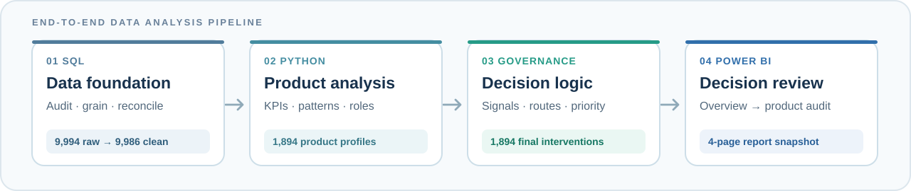

  

# Product Portfolio Decision System

Using the public [Sample - Superstore dataset](https://www.kaggle.com/datasets/vivek468/superstore-dataset-final), this independent project studies **1,894 products** to identify dependable profit, recurring risk, and where review should begin. It reflects my approach to business problems: define the decision, validate evidence, apply explicit rules, and make the result usable and auditable.

## From data to decision

The project follows an **end-to-end data analysis pipeline**:

1. **SQL — establish a controlled base.** Audit **9,994 raw transaction lines**, check the analytical grain, and reconcile **9,986 order × product records**.
2. **Python — diagnose products.** Measure profit, volatility, loss frequency, and scale; distinguish recurring patterns from extremes; and assign analytical roles. The notebook shows the shared calculations and validation.
3. **Governance — resolve the action.** Test each role's initial management route against control signals, assign a final intervention to every product, and select cases for closer review.
4. **Power BI — inspect decisions.** Follow a static four-page snapshot from portfolio exposure to the evidence behind one product's recommendation.

## Explore the repository

| Folder | What it contains and shows |
| --- | --- |
| [`case-study/`](case-study/) | The [case study](case-study/CASE_STUDY.md) and its diagrams explain the business problem, analytical choices, findings, and limits of the recommendations. |
| [`executive-report/`](executive-report/) | The [PDF](executive-report/EXECUTIVE_REPORT.pdf) presents the management narrative; the [PPTX](executive-report/EXECUTIVE_REPORT.pptx) is the editable slide version. |
| [`dashboard/`](dashboard/) | The [Power BI guide](dashboard/POWER_BI_DASHBOARD.md), four screenshots, and [PBIX](dashboard/Product_Portfolio_Dashboard.pbix) show how a reviewer moves from portfolio KPIs to a product-level audit. |
| [`analytical-notebook/`](analytical-notebook/) | The [notebook](analytical-notebook/Product_Portfolio_Risk_Performance.ipynb) presents the calculations, diagnostics, validation, and saved analytical outputs; its [README](analytical-notebook/README.md) explains how to run it. |
| [`python/`](python/) | The [runner](python/run_analysis.py), nine-chapter package, [architecture guide](python/Product_Portfolio_Code_Architecture_Guide.md), and [reports](python/reports/) expose the reusable logic, checks, and decision outputs. |
| [`sql/`](sql/) | The [MySQL script](sql/superstore_sql_audit_cleaning_pipeline.sql) and [cleaning record](sql/SUPERSTORE_CLEANING_PROCESS.md) document source checks, consolidation, reconciliation, and the handoff to Python. |

*Scope: a historical, sample-data decision-support prototype; no measured business impact is claimed. Input CSVs are not committed; see the [`sql/`](sql/README.md) and [`python/`](python/README.md) guides to reproduce the analysis.*
