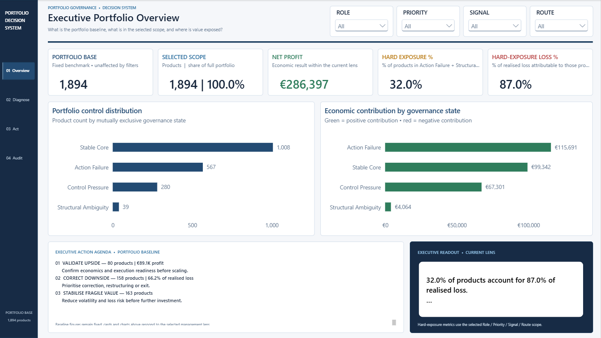
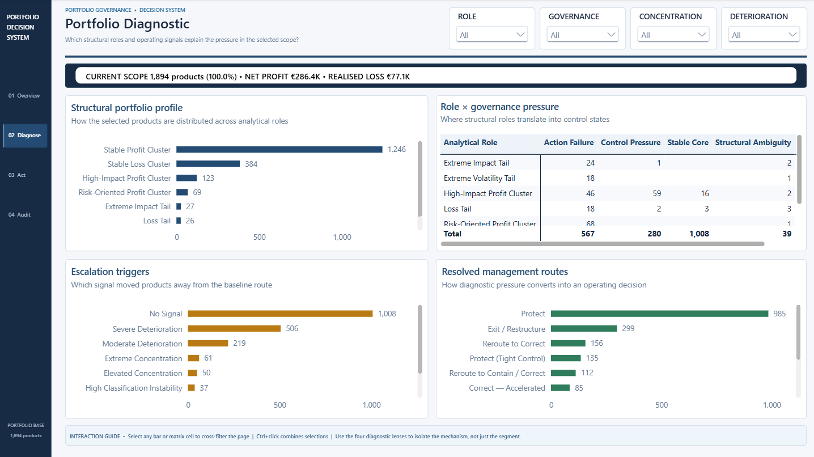
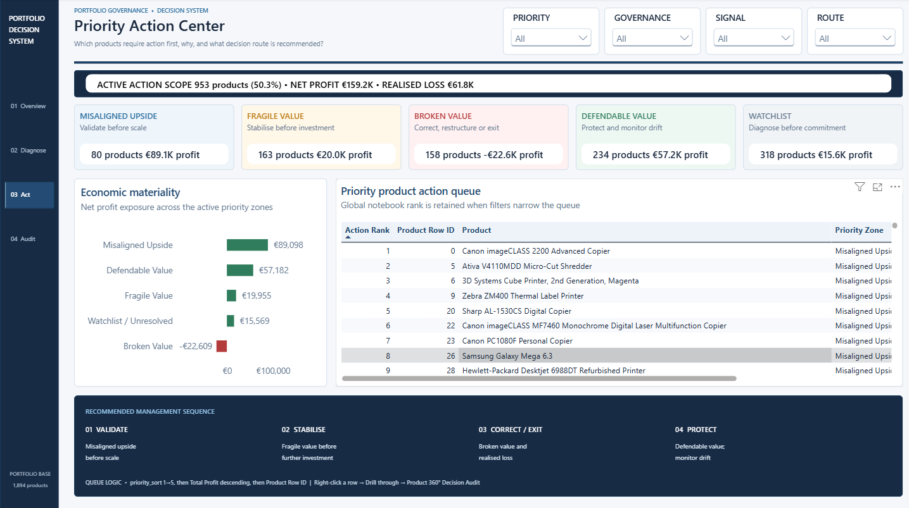
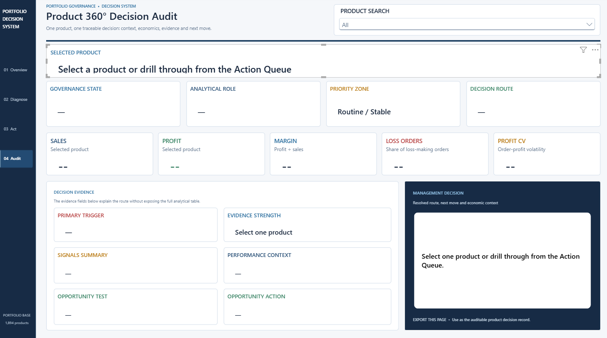

# Power BI Portfolio Governance Decision System

> A four-page Power BI dashboard that turns product-level analysis into clear management priorities and traceable product decisions.

> **Interactive report:** [Download the Power BI dashboard (.pbix)](Product_Portfolio_Dashboard.pbix) and open it in Power BI Desktop. GitHub can display the documentation and screenshots, but it cannot run a `.pbix` report in the browser. If the report is later published to Power BI Service, its live link can be added here.

## Why this dashboard was built

A product portfolio can look healthy at an aggregate level while still containing concentrated profit dependencies, recurring losses and products that are following the wrong management route.

This dashboard was built to make those issues visible and actionable. It helps a manager move from a broad portfolio view to four practical questions:

1. What is the current state of the portfolio?
2. Where are profit and realised losses concentrated?
3. Which products require attention first?
4. Why is a specific action recommended for each product?

The dashboard covers **1,894 products**. Their analytical roles, escalation signals, governance states and recommended interventions are produced by the upstream Python analysis and carried into Power BI without changing the underlying classifications.

## Dashboard at a glance

| Page | Question answered | What the user sees |
| --- | --- | --- |
| **01 Executive Portfolio Overview** | What is the portfolio baseline, and where is value exposed? | Core KPIs, governance distribution, economic contribution and an executive action agenda |
| **02 Portfolio Diagnostic** | What is creating pressure in the selected part of the portfolio? | Product roles, governance outcomes, escalation signals and management routes |
| **03 Priority Action Center** | Which products should management review first? | Active priority scope, economic materiality and a ranked product action queue |
| **04 Product 360° Decision Audit** | Why was this action assigned to this product? | Product economics, supporting evidence, recommended intervention and next move |

## Key portfolio findings

| Finding | Result | Why it matters |
| --- | ---: | --- |
| Portfolio size | **1,894 products** | Complete product-level analytical base |
| Stable Core | **1,008 products — 53.2%** | More than half of the portfolio remains on its baseline management route |
| Hard Exposure | **606 products — 32.0%** | Almost one-third of products require correction or reassessment |
| Active Priority Scope | **953 products — 50.3%** | Half of the portfolio requires a defined management response or closer monitoring |
| Misaligned Upside | **80 products — €89.1K profit** | Valuable products that should be validated before further scaling |
| Broken Value | **158 products — 66.2% of realised loss** | Downside is concentrated enough to support targeted correction, restructuring or exit |
| Fragile Value | **163 products** | Positive value exists, but stability should improve before further investment |

These results highlight an important management distinction: a product can be profitable and still require attention, while a stable-looking segment can still carry meaningful downside exposure.

## Page 1 — Executive Portfolio Overview

The first page gives management a quick reading of the portfolio before moving into detail.

It separates the fixed portfolio baseline from the scope selected through the filters. This allows the user to compare the full portfolio with a specific analytical role, priority zone, signal or intervention route.

The page brings together:

- Total portfolio products and the currently selected scope.
- Net profit under the active filter context.
- The share of products in hard exposure.
- The share of realised loss carried by those products.
- Product distribution across governance states.
- Economic contribution by governance state.
- A short executive agenda showing where management should act first.

The purpose is simple: understand the size of the issue, identify where value is exposed and decide where the deeper review should begin.

## Page 2 — Portfolio Diagnostic

The second page explains what is driving the result seen on the executive overview.

The user can examine the portfolio through four complementary lenses:

- **Analytical Role** — the structural role assigned to each product.
- **Governance State** — whether the current management direction remains appropriate.
- **Concentration Level** — whether economic value depends heavily on a limited number of products.
- **Deterioration Level** — whether product performance shows evidence of weakening.

The visuals connect product structure with governance pressure, escalation signals and final management routes. Selecting a bar or matrix cell filters the rest of the page, allowing the user to move from a broad segment to the specific mechanism behind it.

## Page 3 — Priority Action Center

The third page converts the diagnosis into a practical management queue.

It focuses on the **953 products within the active priority scope**, representing **50.3% of the full portfolio**. The remaining 941 products belong to the Routine / Stable scope and are therefore excluded from the active queue.

The active scope is divided into five priority zones:

- **Misaligned Upside** — validate the economics and execution readiness before scaling.
- **Fragile Value** — stabilise performance before making further investment.
- **Broken Value** — correct, restructure or consider exit.
- **Defendable Value** — protect the current value and monitor for deterioration.
- **Watchlist** — investigate further before committing resources.

The analytical pipeline supplies the priority fields. Power Query sorts the active products and adds the `action_rank` used by the dashboard:

1. Priority-zone order.
2. Total profit, from highest to lowest.
3. Product Row ID as a consistent tie-breaker.

Filters narrow the list but do not recalculate the original priority. This gives the user a stable and auditable queue rather than a ranking that changes unpredictably with every selection.

## Page 4 — Product 360° Decision Audit

The final page explains the recommendation for one selected product.

The user can search directly for a product or drill through from the action queue. The page then brings together:

- Governance State
- Analytical Role
- Priority Zone
- Final Intervention
- Sales, profit and margin
- Share of loss-making orders
- Profit volatility
- Primary escalation signal
- Performance and opportunity context
- Recommended next move

This creates a compact decision record that answers three questions in one place: **What should happen, why should it happen, and what evidence supports the decision?**

## From analysis to management action

The dashboard follows the same decision path as the analytical model:

**Product KPI Profile → Analytical Role → Escalation Signals → Governance State → Final Intervention → Priority Zone**

Power BI provides the interactive reporting and decision layer. The product classifications and governance outcomes remain tied to the upstream analytical methodology, preserving traceability from the source analysis to the final recommendation.

## Data source and calculation flow

The upstream Python pipeline exports the product-level results to [`python/reports/governance_output.xlsx`](../python/reports/governance_output.xlsx). Its `audit_view` contains one row per product (1,894 rows) and the fields used for portfolio economics, analytical roles, governance and priority decisions. The dashboard's `Products` query shows these product-level audit fields.

For portability, this PBIX stores a **copy of the governance workbook inside the report**. The Power Query item `Governance Workbook Binary` decodes that embedded copy with `Binary.FromText`; `Products` reads its workbook data, and `Actions` prepares the filtered, sorted action queue. As a result, **Data sources in current file** does not list an external Excel file.

The classifications, intervention routes and priority fields come from the Python output. DAX uses the loaded product data to calculate what the report currently displays, such as the number of selected products, their net profit and exposure percentages. Slicers change these displayed calculations; they do not rerun the Python analysis or assign a new governance decision.

This is a **static snapshot**. Editing `python/reports/governance_output.xlsx` does not update the workbook copy embedded in an already saved PBIX. To reflect new pipeline results, the embedded copy must be replaced, the model checked and the report republished. Scheduled refresh from an external source would require a different connection design. The snapshot has no reliable time dimension, so the dashboard focuses on structural and management filters rather than time trends.

## How the dashboard can be used

- Use page-specific slicers to investigate the portfolio from different management perspectives.
- Select charts or matrix cells to cross-filter the current page.
- Compare the selected scope with the fixed portfolio baseline.
- Narrow the Priority Action Center without changing the original product ranking.
- Right-click a product in the queue and drill through to its Product 360° audit.
- Read `— No products` as a valid zero-result state when no products match the current filters.

Colours are used consistently across the report: green indicates positive economic contribution, amber highlights control pressure and red is reserved for actual downside or negative profit.

## Technology and implementation

- **Power BI Desktop** for the interactive dashboard.
- **DAX** for KPIs, filter-aware measures, economic exposure and management readouts.
- **Power Query** for reading the embedded workbook, preparing the product data and ranking the action queue.
- **PBIX** format for a portable report that can be downloaded from the repository and opened in Power BI Desktop.
- **Python** for the upstream segmentation, governance logic and economic prioritisation.
