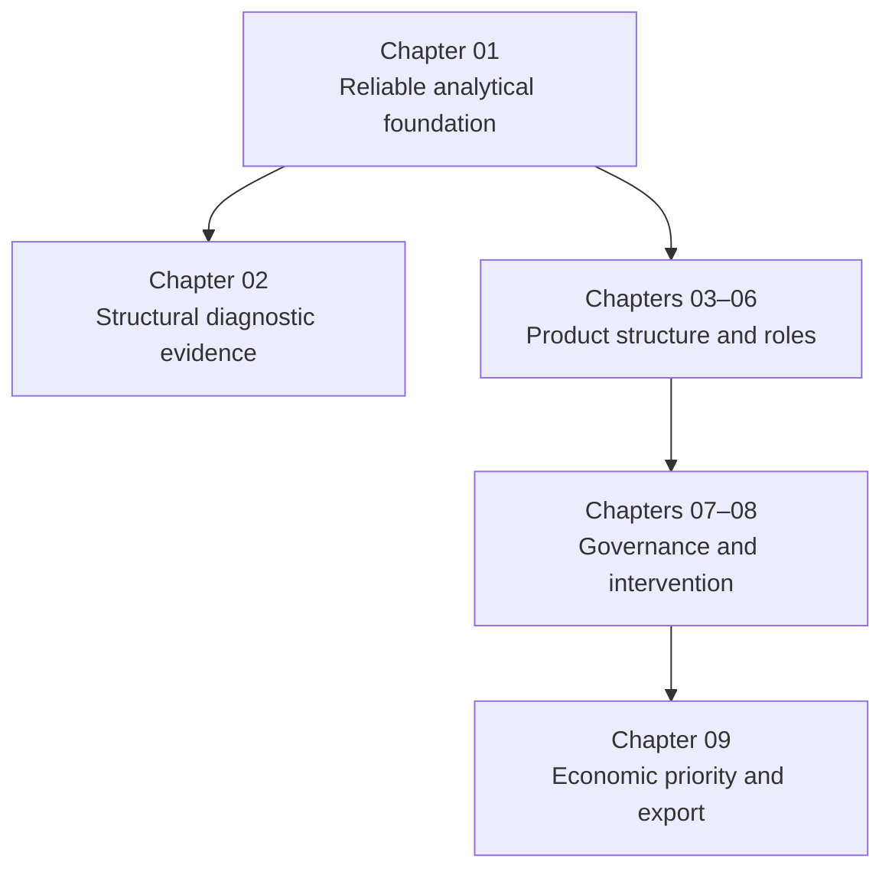
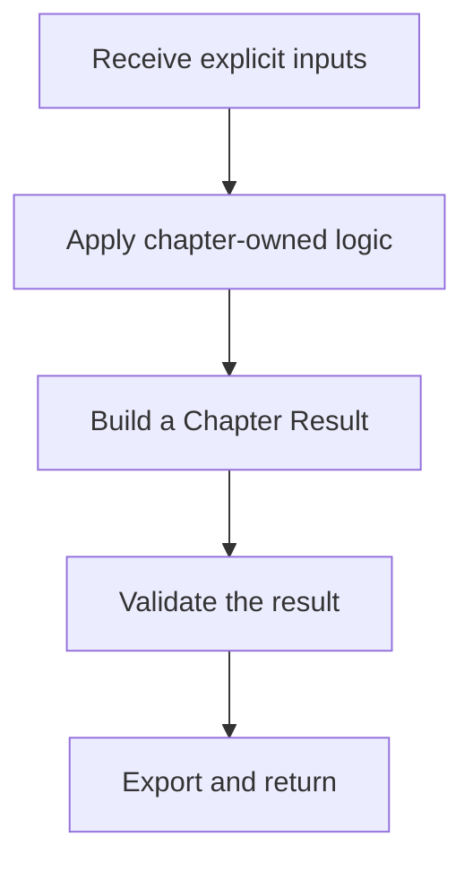
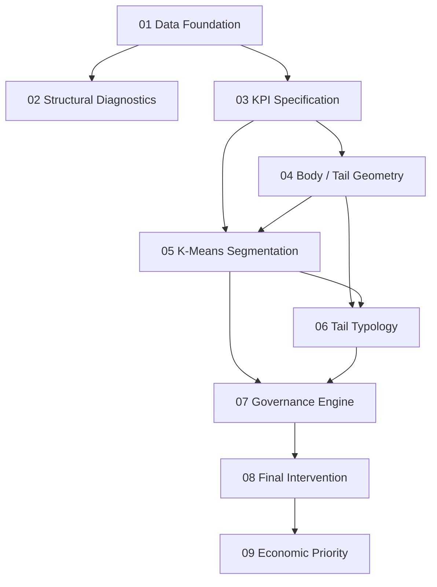

# Product Portfolio Decision System

## A Practical Guide to the Code Architecture

> **Purpose of this guide**  
> This document explains how the codebase is organized, why it was divided into chapters, how information moves through the pipeline, and how the analytical logic becomes a management decision. It is written for a reader who understands the business problem but does not yet feel fully comfortable navigating the Python code.

---

## 1. The system in one sentence

The code is an **auditable analytical pipeline** that starts with SQL-cleaned transaction data, constructs a reliable product-level view, identifies recurring portfolio structures and structural extremes, and converts that evidence into governance actions and management priorities.

It is helpful to think of the system as a chain of controlled handoffs:

```text
Clean data -> Product economics -> Analytical roles -> Governance -> Priority
```

Each stage has a specific responsibility. It receives a defined input, performs a limited set of operations, validates its result, and passes an explicit output to the next stage.

This structure is the central idea behind the architecture.

---

## 2. The main mental model

The project contains two connected layers.

### Analytical structure

The first layer asks:

- What is the correct unit of analysis?
- How does each product behave economically?
- Which products belong to the recurring portfolio structure?
- Which products are structural extremes?
- Which analytical role best describes each product?

These questions are answered mainly by Chapters 01–06.

### Management decision structure

The second layer asks:

- What is the normal management direction for each role?
- Is there evidence that the normal route is insufficient or uncertain?
- What final intervention should each product receive?
- Which products deserve management attention first?

These questions are answered by Chapters 07–09.

The complete logic can therefore be read as:



Chapter 02 is an important **diagnostic evidence branch**. It demonstrates why deeper portfolio modelling is justified, but it does not assign a cluster, role, action, or intervention. The main decision chain continues from Chapter 01 into Chapter 03 and then through Chapters 04–09.

---

## 3. Why the code was divided into separate modules

The original analysis could have remained one long script. That approach can work, but it becomes difficult to answer basic control questions:

- Which function created a particular field?
- Which version of a DataFrame is being used?
- Did a later step accidentally modify an earlier result?
- Where should a business rule be changed?
- Did the analysis retain the complete product universe?
- Can a final decision be traced back to its evidence?

The modular architecture addresses these problems by applying **separation of responsibilities**.

Each chapter owns one analytical question. For example, Chapter 03 owns KPI definition, Chapter 05 owns body clustering, and Chapter 08 owns final intervention routing. A chapter should not silently perform the responsibility of another chapter.

### What this improves

1. **Understandability** — each file has one central purpose.
2. **Traceability** — a final decision can be followed backwards through the pipeline.
3. **Error isolation** — when a validation fails, the responsible stage is identifiable.
4. **Safer changes** — one rule can be revised without rewriting the entire analysis.
5. **Reproducibility** — shared settings and random seeds are controlled centrally.
6. **Auditability** — thresholds, assignments, sensitivity checks, and decision tables are exported explicitly.
7. **Reusability** — a notebook or command-line runner can call the same chapter functions.

### The trade-off

The codebase contains more files and more explicit handoff objects than a monolithic script. This creates some initial navigation cost. The benefit is that the analytical process is much easier to inspect, test, explain, and maintain.

In other words, the architecture accepts a little more structure now in exchange for much less ambiguity later.

### The architecture in three practical rules

The full design can be reduced to three rules:

1. **Each chapter has a declared boundary.** It receives explicit inputs through its `run_chapter_XX()` function and owns one analytical responsibility. It does not depend on hidden notebook state or an uncontrolled collection of global analytical variables.
2. **Results move through named contracts.** A chapter returns a `ChapterXXResult` containing the objects that later stages are allowed to use. Dependencies therefore remain visible.
3. **A handoff is validated before it is trusted.** If coverage, reconciliation, classification, or an approved project baseline fails, the pipeline stops instead of silently passing a questionable result downstream.

These rules are more important than the individual algorithms. They are what make the codebase readable and the final decisions defensible.

---

## 4. Project structure

The modules are designed to form a Python package similar to the following:

```text
portfolio_pipeline/
├── __init__.py
├── config.py
├── contracts.py
├── validation.py
└── chapters/
    ├── __init__.py
    ├── ch01_data_foundation.py
    ├── ch02_structural_diagnostics.py
    ├── ch03_kpi_specification.py
    ├── ch04_body_tail_geometry.py
    ├── ch05_kmeans_segmentation.py
    ├── ch06_tail_typology.py
    ├── ch07_governance_engine.py
    ├── ch08_final_intervention.py
    └── ch09_economic_priority.py
```

The files fall into three groups.

| Group | Files | Responsibility |
|---|---|---|
| Shared infrastructure | `config.py`, `contracts.py`, `validation.py` | Common settings, explicit handoffs, and runtime controls |
| Analytical chapters | Chapters 01–06 | Data foundation, KPIs, segmentation, and analytical roles |
| Decision chapters | Chapters 07–09 | Governance signals, interventions, and active management priorities |

The two `__init__.py` files identify directories as importable Python packages. The package-level file also exposes `AnalysisConfig` as a convenient public entry point. They contain very little logic because their purpose is organization, not analysis.

---

## 5. The three supporting structures

Before looking at the nine chapters, it is important to understand the three files that support the entire pipeline.

### 5.1 `config.py` — shared technical settings

`AnalysisConfig` contains the settings that multiple chapters need:

- Input CSV path.
- Reports directory.
- Random seed.
- Selected number of clusters.
- Number of resampling iterations.
- Whether the locked project baseline should be enforced.

It also creates the standard output directories used for reports and figures.

The key design choice is that `config.py` contains **technical runtime settings**, not analytical meaning. For example, the shared `random_state` belongs in configuration. The definition of a severe deterioration condition belongs beside the governance logic that uses it.

This keeps business rules visible in their analytical context instead of hiding them in a generic settings file.

`AnalysisConfig` is also immutable after creation. This reduces the risk that one chapter silently changes a shared setting while the pipeline is running.

### 5.2 `contracts.py` — explicit chapter handoffs

Every chapter returns a named result object such as:

```python
Chapter01Result
Chapter05Result
Chapter09Result
```

These objects are Python dataclasses. Each one declares the official outputs of its chapter.

For example, `Chapter05Result` contains the fitted scaler, the K-Means model, the body assignments, the stability results, the cluster profile, and the export paths. Chapter 07 can therefore request a `Chapter05Result` instead of depending on a collection of unrelated global variables.

A simple analogy is useful:

> Each chapter hands the next chapter a labelled and checked folder, not a desk covered with loose papers.

The contracts provide three protections:

1. **Visible dependencies** — we can see what each chapter requires.
2. **Stable handoffs** — downstream code uses declared outputs rather than accidental intermediate variables.
3. **Reduced mutation risk** — the result containers are frozen after creation.

The DataFrames inside a result can technically still be changed by pandas operations, but the result object itself cannot be casually reassigned. The architecture therefore encourages chapters to copy a DataFrame before adding new fields.

#### Why use dataclasses instead of ordinary dictionaries?

A dictionary can contain any key at any time, so a misspelled or missing key may remain hidden until much later. A dataclass gives each chapter result a named, documented structure that is easier to inspect, type-check, and use with editor assistance.

This is a design aid, not automatic runtime type enforcement. Python does not inspect every DataFrame field simply because it appears in a dataclass annotation. The real protection comes from combining explicit contracts with the runtime checks in `validation.py`.

#### What does `frozen=True` actually protect?

`frozen=True` prevents a result field from being rebound accidentally. For example, downstream code cannot casually replace `chapter_05.kmeans` with another object.

It does **not** make a pandas DataFrame internally immutable. A DataFrame stored inside the result can still be modified. This is why chapter functions generally create a copy before adding or changing fields.

#### Why does `product_row_id` appear in the governance layer?

`product_id` alone is not unique in the source data. The analytical product is defined by the `product_id × product_name` pair, and its DataFrame index is preserved as the pipeline develops.

Chapter 07 makes that row identity explicit as `product_row_id`. This gives governance exports a stable row-level audit key even when products are sorted, merged, or presented in different views. It does not replace the business identifiers; it protects the identity of the analytical record across later decision tables.

### 5.3 `validation.py` — the control layer

`validation.py` protects the boundaries between chapters. It checks whether the result produced by one stage still satisfies the assumptions required by the next stage.

Examples include:

- Required input columns are present.
- The declared grain is unique.
- Sales and profit reconcile across aggregations.
- All products remain represented.
- Body and Tail are disjoint and collectively exhaustive.
- The selected clustering model and role mapping are complete.
- Every product receives one valid governance status.
- The 4 × 4 intervention matrix has 100% coverage.
- The Priority Zone audit covers the complete portfolio.
- Required CSV, image, and Excel files were actually exported.

The code follows a **fail-fast** principle. If a critical condition is false, it raises a `PipelineValidationError` rather than allowing a misleading report to be produced.

Two types of checks are present:

#### Structural checks

These should remain true for any valid dataset. Examples are uniqueness, full coverage, valid categories, non-overlap, and economic reconciliation.

#### Locked project-baseline checks

These confirm that the current Superstore run reproduces the approved project outputs. Examples include:

- 9,986 input rows.
- 1,894 analytical product pairs.
- 1,822 Body products and 72 Tail products.
- The selected `K=4` model.
- Known cluster, governance-state, and Priority Zone counts.

These dataset-specific checks run when `strict_project_baseline=True`, which is the current default. They are valuable for reproducibility, but they should be disabled or replaced deliberately when the pipeline is moved to a genuinely different dataset.

---

## 6. The repeating pattern inside each chapter

Most chapters use the same broad structure:



At the bottom of each module is a function named `run_chapter_XX()`.

This is the chapter's **front door**. It coordinates the smaller functions in the correct order, builds the result contract, runs validation, optionally displays the outputs, and returns the validated result.

A simplified version of the pattern is:

```python
def run_chapter_xx(config, upstream_result):
    prepared_data = prepare_data(upstream_result)
    analytical_output = apply_chapter_logic(prepared_data)

    result = ChapterXXResult(
        analytical_output=analytical_output,
    )

    validate_chapter_xx(result)
    return result
```

This is not the literal implementation of every chapter, but it accurately represents the architecture.

### The easiest way to read a chapter

When opening an unfamiliar chapter, use this order:

1. Read the module description at the top.
2. Go to `run_chapter_XX()` at the bottom.
3. Identify the small functions called by the runner.
4. Open those functions one at a time.
5. Read the corresponding validation function last.

This prevents the reader from getting lost in implementation details before understanding the flow.

---

## 7. Complete dependency map

The chapters are related, but they do not form a perfectly straight line. Some later chapters need evidence from more than one earlier stage.



The dependency pattern is intentional:

- Chapter 05 needs the KPI table from Chapter 03 and the Body definition from Chapter 04.
- Chapter 06 needs the Body/Tail boundaries from Chapter 04 and the Body assignments from Chapter 05.
- Chapter 07 needs both the fitted Body model from Chapter 05 and the unified seven-role taxonomy from Chapter 06.

This prevents later stages from attempting to reconstruct important earlier decisions from incomplete data.

---

## 8. Chapter-by-chapter walkthrough

## 8.1 Chapter 01 — Data Foundation and Analytical Grain

### Question answered

What exactly is one observation in this analysis, and do the economics remain correct after aggregation?

### What it receives

The SQL-cleaned CSV export.

SQL owns data cleaning. This chapter does not remove observations, redefine records, or silently impute business values. It restores data types that CSV storage cannot preserve, particularly dates and numeric fields.

### What it does

The chapter creates two canonical analytical grains:

1. **Order × Product occurrence** — one row for a product within an order.
2. **Product ID × Product Name pair** — one row for each analytical product.

The first grain prevents repeated source lines inside the same order from receiving artificial behavioural weight. The second is required because `product_id` alone is not unique in this dataset.

Chapter 01 also creates:

- Product-level sales and profit totals.
- Product dimension information.
- Loss behaviour by product.
- The first product-level diagnostic table.

### Why this choice matters

The grain determines what every later mean, standard deviation, loss rate, and cluster represents. If the grain is wrong, the later analysis can be mathematically correct but economically misleading.

That is why the first validation checks uniqueness, complete coverage, and sales/profit reconciliation across grains.

### What it returns

`Chapter01Result`, containing the loaded transaction data, the order-product table, product totals, the product dimension, the loss profile, and the first product-level analytical table.

---

## 8.2 Chapter 02 — Structural Portfolio Diagnostics

### Question answered

Is the portfolio sufficiently uneven to justify structural segmentation and differentiated management?

### What it receives

The product-level diagnostic table created in Chapter 01.

### What it does

It examines four aspects of the portfolio:

1. **Profit concentration** — how much positive profit is created by the leading products.
2. **Profit-distribution asymmetry** — whether product economics are balanced or heavily skewed.
3. **Category dispersion** — whether categories appear to share one common economic centre.
4. **Recurring downside** — whether losses are isolated events or repeated across product orders.

These views are combined into an executive diagnostic figure and compact summary exports.

Extreme values may be clipped for chart readability, but only in the displayed series. The analytical evidence is not modified.

### Why it is a separate branch

Chapter 02 supports the modelling decision; it does not perform the modelling. No cluster or management action should exist merely because a chart looks unusual.

Keeping diagnostics separate prevents descriptive evidence from being confused with classification logic.

### What it returns

`Chapter02Result`, containing the diagnostic evidence, summary statistics, and export paths.

This result supports reporting and methodological justification. The main classification chain continues from Chapter 01 to Chapter 03.

---

## 8.3 Chapter 03 — KPI Specification

### Question answered

How can each product's economic behaviour be represented in a compact but meaningful form?

### What it receives

The order-product table and product economic totals from Chapter 01.

### The four modelling coordinates

Each product is represented by four complementary KPIs:

| KPI | Meaning |
|---|---|
| `mean_order_profit` | Typical profit contribution per order occurrence |
| `cv_order_profit` | Relative variability of order profit |
| `pct_orders_loss` | Frequency of loss-making order occurrences |
| `profit_scale` | Signed total-profit impact relative to the portfolio's most extreme product |

The four coordinates answer different questions: direction, dispersion, downside frequency, and economic materiality.

### CV stabilization

The coefficient of variation can become extremely large when average profit is close to zero. The chapter therefore:

1. Builds a dataset-scaled denominator adjustment using the first percentile of absolute mean order profit.
2. Retains the uncapped raw CV as audit evidence.
3. Flags products with fewer than two observations, for which standard deviation cannot be estimated.
4. Caps the modelling CV at the empirical 99th percentile.
5. Keeps the audit fields attached to the product record.

The goal is not to hide volatility. It is to stop a mechanically unstable ratio from dominating geometric distance while preserving the raw evidence for governance and review.

`profit_scale` is calculated as:

```text
product total profit / maximum absolute product profit
```

It therefore remains between `-1` and `1`, preserves the profit/loss sign, and expresses materiality relative to the strongest observed product impact.

### What it returns

`Chapter03Result`, including the raw volatility table, CV audit, complete product metrics, modelling table, and the calculated stabilization values.

---

## 8.4 Chapter 04 — Body/Tail Geometry

### Question answered

Which products belong to the recurring portfolio structure, and which are structural extremes that require a different mechanism?

### What it receives

The complete four-KPI product table from Chapter 03.

### What it does

The chapter first confirms that the modelling space contains no missing or infinite values. It does not silently drop invalid rows because that would reduce portfolio coverage without a visible decision.

It then applies empirical first-to-99th-percentile boundaries to:

- Mean Order Profit.
- Stabilized CV.
- Profit Scale.

Loss Rate remains a clustering feature but is not used as a Body-entry filter. This preserves repeated downside as meaningful behaviour within the central portfolio rather than treating it automatically as an extreme.

### Why Body and Tail are separated

K-Means minimizes squared Euclidean distance. A small number of extreme products can therefore exert excessive leverage on centroid positions, even after standardization.

The design response is not to delete those observations. Instead:

- The **Body** is analysed using K-Means.
- The **Tail** is retained one-for-one and classified through explicit rules in Chapter 06.

This is mechanism selection, not outlier removal.

### Sensitivity

The chapter tests several percentile boundaries rather than presenting the selected first-to-99th-percentile definition as an unquestioned fact. It compares product retention and cluster separation across alternative boundaries.

### What it returns

`Chapter04Result`, including the full KPI geometry, selected Body mask, Body products, Tail candidates, boundary definitions, sensitivity evidence, and export paths.

---

## 8.5 Chapter 05 — K-Means Structural Segmentation

### Question answered

What recurring economic structures exist within the portfolio Body?

### What it receives

The complete KPI table from Chapter 03 and the selected Body definition from Chapter 04.

### Scaling

The four KPIs use different units and numerical ranges. `StandardScaler` transforms each Body feature to a comparable scale before Euclidean distance is calculated.

Scaling prevents the numerically largest KPI from dominating the model. It does not eliminate the effect of structural extremes; that is why Body/Tail separation occurred first.

### Model selection and fitting

The chapter compares `K=1` through `K=8` using:

- **Inertia** for within-cluster compactness.
- **Silhouette score** for separation from competing clusters.

The documented final model uses `K=4`, a fixed random seed, and 20 initializations.

Only Body products are fitted. Tail products are restored to the complete portfolio table with the explicit label `Unclustered`. They are not missing; they are waiting for the appropriate Tail mechanism in Chapter 06.

### Stability checks

The chapter performs two important robustness checks:

1. Repeated 80% product resampling, with scaling and K-Means refitted inside every repetition.
2. A sensitivity run excluding products whose CV is not statistically estimable.

Adjusted Rand Index is used because it compares partitions while correcting for chance and is not confused by a change in the numerical cluster labels.

### From numeric clusters to business roles

K-Means labels such as `0`, `1`, `2`, and `3` have no natural business meaning. They are translated after fitting into four documented Body roles:

- Stable Profit Cluster.
- High-Impact Profit Cluster.
- Risk-Oriented Profit Cluster.
- Stable Loss Cluster.

The translation is based on the cluster profile in original KPI units. If the model is re-estimated on a new population, the profile and mapping must be checked again rather than assumed to remain correct.

### What it returns

`Chapter05Result`, containing the scaler, fitted model, assignments, model-selection table, stability evidence, Body role profile, and exports.

---

## 8.6 Chapter 06 — Structural Tail Typology

### Question answered

How should structural extremes be classified without forcing them into unsuitable centroids or deleting them as outliers?

### What it receives

The Body/Tail boundaries from Chapter 04 and the Body assignments from Chapter 05.

### Body-anchored references

Tail thresholds are estimated from the recurring Body structure. Extreme products do not participate in the percentiles used to judge their own extremity.

This avoids a circular rule in which increasingly extreme Tail products move the boundary used to define the Tail.

### Raw mechanisms and reporting ownership

A Tail product may show more than one mechanism:

- Loss.
- Extreme volatility.
- Extreme positive impact.

The raw flags are deliberately non-exclusive because overlap is valuable governance evidence.

For reporting, however, every product needs one primary role. The hierarchy is:

```text
Loss -> Volatility -> Impact
```

Products that entered the Tail only through the Mean Order Profit boundary are still assigned through an explicit and audited directional rule. They are not placed into an unexplained residual category.

### Unified seven-role taxonomy

The four Body roles and three Tail roles are combined:

| Domain | Analytical roles |
|---|---|
| Clustered Body | Stable Profit, High-Impact Profit, Risk-Oriented Profit, Stable Loss |
| Structural Tail | Extreme Impact, Extreme Volatility, Loss Tail |

At this point every analytical product has exactly one role, while secondary Tail mechanisms remain preserved as evidence.

### What it returns

`Chapter06Result`, containing the unified portfolio, Tail references, assignment audits, overlap evidence, role profile, exported Tail classification, and portfolio geometry figure.

---

## 8.7 Chapter 07 — Governance Engine

### Question answered

Given a product's analytical role, what is its normal management direction, and is there evidence requiring escalation or reassessment?

### Baseline action

Each of the seven roles first receives one default `primary_action`:

| Analytical role | Primary action |
|---|---|
| Stable Profit Cluster | Protect |
| High-Impact Profit Cluster | Optimize |
| Risk-Oriented Profit Cluster | Contain |
| Stable Loss Cluster | Correct |
| Extreme Impact Tail | Optimize |
| Extreme Volatility Tail | Contain |
| Loss Tail | Correct |

The Primary Action answers **what this type of product normally requires**. It does not yet describe urgency.

### Four independent governance signals

The chapter then evaluates four different forms of evidence:

1. **Deterioration** — a role-specific operating tolerance has been breached.
2. **Concentration** — the portfolio depends materially on a high-impact profit contributor.
3. **Tail Overlap** — more than one extreme Tail mechanism is present.
4. **Classification Instability** — the product is weakly anchored to its assigned structure.

For Body products, Classification Instability is based on the normalized margin between the assigned centroid and the nearest alternative centroid. A small margin means the competing cluster is almost as plausible.

Tail products do not have centroids. Their stability is therefore measured by the distance or excess from the Body-anchored boundary responsible for their Tail role.

### Static, not temporal

The word `Deterioration` is a governance label for a current tolerance breach. The chapter does not contain time-series evidence proving that the product has worsened over time.

Similarly, Classification Instability indicates weak structural anchoring. It does not prove that a product migrated between roles across periods.

### Escalation precedence

Several signals can be active simultaneously. The system keeps all of them but resolves the management status using explicit precedence:

```text
Reassess Classification
        > Reroute Action
        > Intensify Action
        > No Escalation
```

The precedence prevents contradictory final routes. `primary_signal` provides a reader-facing owner, while the active-signal fields preserve the complete evidence.

### What it returns

`Chapter07Result`, including the complete governance control table, Body references, thresholds, signal summaries, escalation summaries, and audit exports.

---

## 8.8 Chapter 08 — Final Intervention

### Question answered

What single, operational intervention follows from the product's baseline action and escalation status?

### The closed routing matrix

There are four Primary Actions and four Escalation Statuses. Their combination creates a closed 4 × 4 decision matrix:

```text
f(primary_action, escalation_status) -> final_intervention
```

Examples include:

- `Protect` + `No Escalation` -> `Protect`.
- `Optimize` + `Intensify Action` -> `Optimize (Risk-Controlled)`.
- `Correct` + `Reroute Action` -> `Exit / Restructure`.
- Any Primary Action + `Reassess Classification` -> `Reassess Classification`.

An unknown combination is treated as an error. It is not assigned to a generic fallback category. This guarantees that the routing logic is inspectable and that full coverage is tested.

### Executive scorecard

The detailed routes are compressed into four control states:

| Escalation Status | Scorecard state |
|---|---|
| No Escalation | Stable Core |
| Intensify Action | Control Pressure |
| Reroute Action | Action Failure |
| Reassess Classification | Structural Ambiguity |

The scorecard calculates Product Share, Profit Share, and Loss Share. These measures use different denominators and answer different management questions. They should not be interpreted as one common percentage composition.

### Governance sensitivity

Strict, baseline, and lenient calibration scenarios move governance thresholds while keeping the analytical roles and precedence logic fixed.

This isolates one question: does hard exposure remain material under reasonable changes in calibration?

It is not an attempt to find thresholds that reproduce the baseline result exactly.

### What it returns

`Chapter08Result`, containing final routes, coverage audits, scorecards, sensitivity results, and the governance-flow exports.

---

## 8.9 Chapter 09 — Economic Priority Layer

### Question answered

Among the fully governed portfolio, where should limited management attention go first?

### Priority is narrower than governance

Governance covers every product. Priority Zones cover only products that meet one of five active management contexts.

A product without a Priority Zone is not ignored. It retains its analytical role, Primary Action, Escalation Status, and Final Intervention. It is simply outside the current active-attention queue.

### Role-relative comparison

Products are compared with peers in their own analytical role because the seven roles represent different expected economics.

The chapter builds role-level profit, volatility, and loss-rate references. It then classifies each product as:

- High Positive Deviation.
- Positive Deviation.
- Role-Aligned.
- Negative Deviation.

Percentile position performs the classification. The calculated z-score is explanatory, not the executing decision threshold.

### Reliability guards

Positive relative performance is not automatically treated as scalable opportunity. A reliable hidden-opportunity candidate must also pass five absolute checks:

1. Positive total profit.
2. Positive mean order profit.
3. Loss Rate no greater than 30%.
4. CV no greater than 2.0.
5. No severe Deterioration signal.

This prevents a product with attractive profit but unacceptable volatility or recurring loss from being labelled as safe upside.

### Five Priority Zones

The qualifying contexts are mapped one-to-one into:

- **Misaligned Upside** — reliable upside under governance escalation; its underlying context is `True Hidden Opportunity`.
- **Fragile Value** — upside exists, but reliability checks fail.
- **Broken Value** — downside is confirmed under a hard governance condition.
- **Defendable Value** — the product outperforms while remaining within its governance route.
- **Watchlist / Unresolved** — underperformance requires diagnosis or monitoring.

The zones are ordered presentation categories, not a continuous numerical ranking.

### Opportunity sensitivity

The hidden-opportunity signal is stress-tested across 36 combinations of:

- Role-profit percentile.
- Maximum Loss Rate.
- Maximum CV.

The test evaluates whether the opportunity remains economically material under reasonable threshold movement. It does not prove future performance or identical membership in every scenario.

### Final workbook

The chapter exports `governance_output.xlsx` with two views:

- `manager_view` — a compact decision surface.
- `audit_view` — the full evidence needed to reconstruct each route.

### What it returns

`Chapter09Result`, containing role benchmarks, reliability evidence, Priority Zones, sensitivity results, manager view, complete audit table, and export paths.

---

## 9. The journey of one product

The easiest way to understand the complete system is to follow a single product.

### Step 1 — Build the correct observation

Its transaction rows are collapsed to the Order × Product grain in Chapter 01. Its total sales and profit are reconciled to the source data.

### Step 2 — Describe its economic behaviour

Chapter 03 calculates its mean order profit, stabilized CV, loss frequency, and relative profit impact. Raw CV and evidence quality remain attached.

### Step 3 — Select the appropriate structural mechanism

Chapter 04 decides whether the product belongs to the recurring Body or the structural Tail.

### Step 4 — Assign an analytical role

- A Body product receives a K-Means assignment and one of four Body roles.
- A Tail product receives a rule-based Tail classification and one of three Tail roles.

Chapter 06 combines both domains so every product has one of seven analytical roles.

### Step 5 — Establish the normal management route

Chapter 07 maps the role to Protect, Optimize, Contain, or Correct.

### Step 6 — Evaluate control pressure

The same chapter checks Deterioration, Concentration, Tail Overlap, and Classification Instability. Precedence converts overlapping evidence into one Escalation Status.

### Step 7 — Produce the final intervention

Chapter 08 combines the Primary Action and Escalation Status through the 4 × 4 routing matrix.

### Step 8 — Decide whether it deserves active priority

Chapter 09 compares the product with role peers, applies reliability guards, and determines whether it belongs in one of the five active Priority Zones.

The final intervention and the Priority Zone answer different questions:

- **Final Intervention:** What should happen to this product?
- **Priority Zone:** Should management review it before other governed products?

---

## 10. The most important architectural principles

### 10.1 Preserve the complete portfolio

Products are not silently removed because they are extreme, inconvenient, or statistically difficult. Tail products and products with non-estimable CV remain visible and are handled explicitly.

### 10.2 Preserve raw evidence and modelling evidence separately

The model may use a stabilized or capped coordinate, but the raw value and support flag remain available for audit.

### 10.3 Use the correct mechanism for the correct domain

K-Means is used for recurring Body geometry. Explicit rules are used for structural Tail cases. Neither method is forced to solve a problem for which it is poorly suited.

### 10.4 Separate classification from action

An analytical role describes what a product is structurally. A Primary Action translates that role into management direction. Escalation adds urgency or uncertainty. Final Intervention resolves the complete route.

These are separate concepts and separate code stages.

### 10.5 Separate governance from priority

Governance is complete coverage. Priority is a selective queue for scarce attention. This prevents routine products from being treated as missing merely because they are not currently high priority.

### 10.6 Make thresholds visible

Thresholds are stored beside their analytical logic and exported for inspection. They are not buried inside an unexplained final label.

### 10.7 Resolve conflicts without deleting evidence

Precedence produces one management status, but secondary signals remain available. The system simplifies the decision without simplifying away the evidence.

### 10.8 Validate every handoff

The pipeline checks coverage and reconciliation after every major transformation, not only at the final output.

---

## 11. Where a future change belongs

One benefit of the architecture is that a proposed change has a natural owner.

| Proposed change | Correct location |
|---|---|
| Input or report path | `config.py` |
| Fields returned by a chapter | `contracts.py` |
| Required columns or coverage rules | `validation.py` |
| Transaction or product grain | Chapter 01 |
| Structural diagnostic chart | Chapter 02 |
| KPI or CV definition | Chapter 03 |
| Body/Tail boundary | Chapter 04 |
| K selection, scaling, or Body role mapping | Chapter 05 |
| Tail threshold, precedence, or assignment | Chapter 06 |
| Governance signal or escalation precedence | Chapter 07 |
| Intervention matrix or scorecard mapping | Chapter 08 |
| Reliability guard or Priority Zone logic | Chapter 09 |

This does not mean only one file will ever change. A material rule change may also require an updated contract, validation, export, or documentation. The table identifies where the analytical meaning is owned.

### A safe change workflow

When a rule or model setting changes:

1. Change the logic in the module that owns the analytical meaning.
2. Run that chapter and every dependent downstream chapter.
3. Inspect reconciliation, coverage, sensitivity, and exported decision changes.
4. Update a locked baseline only when the new result has been reviewed and intentionally approved.

Do not delete or weaken a validation merely to make a run pass. A failed check is evidence that an assumption or approved output changed. The correct response is to understand that change and then decide whether the code, the data, or the expected baseline should be revised.

---

## 12. Outputs and their audiences

Not every exported file serves the same reader.

### Output locations

The shared configuration writes persistent artifacts to two standard locations:

- `reports/` — CSV and Excel decision, audit, and summary tables.
- `reports/figures/` — PNG analytical and reporting figures.

The principal exported artifacts are:

| Chapter | Main persistent outputs |
|---|---|
| Chapter 02 | `stage1_diagnostic_dashboard.png`, `stage1_product_diagnostics.csv`, `stage1_structural_summary.csv` |
| Chapter 04 | `kpi_empirical_body_thresholds.csv`, `body_boundary_sensitivity_check.csv` |
| Chapter 05 | Model-selection, cluster-stability, CV-support, and cluster-profile CSVs |
| Chapter 06 | `tail_classification_export.csv`, `analytical_role_profile.csv`, `portfolio_geometry_loss_intensity_map.png` |
| Chapter 07 | `governance_threshold_reference.csv`, `governance_signal_summary.csv` |
| Chapter 08 | Governance-flow, final-intervention, scorecard, pressure, and sensitivity CSVs |
| Chapter 09 | Priority summaries and decisions, opportunity sensitivity, and `governance_output.xlsx` |

Chapters 01 and 03 mainly construct validated in-memory foundations used by later stages. Their evidence is carried through the result contracts rather than being treated as final management deliverables.

### Analytical audit outputs

These help reconstruct and challenge the method:

- CV stabilization audit.
- Body thresholds.
- Boundary sensitivity.
- K-Means model selection.
- Cluster stability iterations.
- Tail assignment audits.
- Governance threshold references.
- Hidden-opportunity sensitivity.

### Analytical interpretation outputs

These explain the portfolio structure:

- Structural diagnostic summary.
- Cluster profiles.
- Analytical role profiles.
- Tail classification export.
- Portfolio geometry figure.

### Management outputs

These support action and reporting:

- Governance signal summary.
- Final intervention summary.
- Governance scorecard.
- Priority Zone summary.
- Priority product decisions.
- `governance_output.xlsx`.

The distinction matters. An audit table may be essential for defensibility without being suitable for a CFO dashboard. A manager view may be concise without containing enough detail to reproduce the decision. The system intentionally produces both.

---

## 13. What the system is — and what it is not

### What it is

- A modular product-portfolio analytical pipeline.
- A static diagnostic and triage system.
- A complete and auditable governance-routing framework.
- A repeatable way to translate product economics into management attention.
- A bridge between analytical detail and decision-oriented outputs.

### What it is not

- A forecast of future product profit.
- A causal model of why profit or loss occurs.
- A time-series deterioration model.
- An autonomous decision-maker.
- A guarantee that a Priority Zone will create commercial value.
- A complete production deployment platform by itself.

The outputs should support investigation and management judgement. They should not replace commercial context, operational feasibility, or accountable human review.

---

## 14. Current maturity and production considerations

The present code is stronger than a one-off notebook because it already includes:

- Modular ownership of analytical logic.
- Explicit data contracts.
- Reproducible configuration.
- Runtime validation.
- Sensitivity analysis.
- Manager and audit outputs.
- Deterministic decision tables.

It is best described as a **production-oriented analytical pipeline**, not yet a fully deployed production service.

A live implementation would normally add:

- Scheduled orchestration.
- Versioned input schemas and data-quality alerts.
- Automated unit and integration tests in CI.
- Structured logs and run identifiers.
- Versioned models, thresholds, and output artifacts.
- Monitoring for data drift and role-distribution changes.
- Review and approval ownership for rule changes.
- Access control for commercial data and exported decisions.

The current modular structure makes those additions realistic because the analytical responsibilities are already separated. Deployment would wrap and monitor the pipeline rather than require the analytical logic to be rebuilt from the beginning.

---

## 15. Final perspective

The most important feature of this architecture is not that the analysis uses K-Means, percentiles, or governance rules. It is that the full decision path remains visible:

```text
Source records
    -> Correct analytical grain
    -> Product KPI evidence
    -> Body or Tail mechanism
    -> Analytical role
    -> Primary Action
    -> Governance Signals
    -> Escalation Status
    -> Final Intervention
    -> Active Priority Zone
```

A result such as `Exit / Restructure`, `Optimize (Risk-Controlled)`, or `Misaligned Upside` is therefore not an isolated label. It can be traced backwards through the decision rules, role assignment, KPI profile, and original product economics.

That traceability is what turns the project from a collection of calculations into a defensible decision system.
